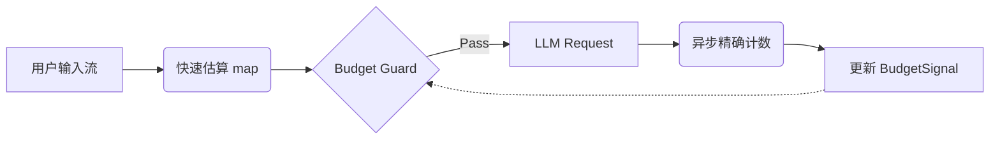

# Chapter 12｜Token Budget 控制：预算就是产品体验

## 1. 开篇：为什么 Token Budget 是核心体验问题？

在许多 LLM 应用开发者的初级认知中，Token 限制往往只被视为“成本控制（Cost Control）”或“技术限制（Context Window Limit）”。然而，在实时 Agent 系统中，**Token Budget 是直接决定产品体验（UX）的核心资源**。

想象一下以下场景：
1.  **截断灾难**：用户正在听一个精彩的故事，结果因为 token 耗尽，故事在“关键揭秘”前戛然而止。
2.  **延迟爆炸**：为了回答一个简单问题，Agent 错误地加载了 100 篇文档进入上下文，导致首字延迟（TTFT）飙升到 10 秒。
3.  **智商掉线**：因为前面的无关对占满了上下文窗口，导致 Agent “忘记”了用户的核心指令。

在 FRP（Functional Reactive Programming）架构中，我们将 Token Budget 视为一种**随时间变化的信号（Signal）**，而不是一个静态的配置项。它像汽车的油表或游戏的魔法值（Mana）一样，需要实时观测、动态预测和精细管理。

**本章目标**：学习如何建立一套反应式的 Token 预算系统，通过 FRP 算子实现流式扣费、动态截断、分级策略和风险熔断，确保 Agent 在有限资源下提供最优的智能表现。

---

## 2. 核心论述

### 2.1 预算分解：你的 Token 去哪了？

要控制预算，首先要建立清晰的“账本”。在实时 Agent 中，Token 消耗不仅仅是 `Prompt + Completion` 那么简单。

我们将预算 $B_{total}$ 分解为以下流动的分量：

$$ B_{total} = P_{sys} + P_{ctx} + P_{rag} + P_{tool} + C_{think} + C_{reply} $$

*   **$P_{sys}$ (System Instructions)**: 固定的“人设”和基指令。通常是常数，但随着 Agent 功能增加会膨胀。
*   **$P_{ctx}$ (Conversation Context)**: 历史对话记录。随时间线性增长，是预算杀手。
*   **$P_{rag}$ (Retrieved Knowledge)**: 动态注入的参考资料。波动性极大。
*   **$P_{tool}$ (Tool Definitions & Receipts)**: 工具的 Schema 定义和执行结果回执。
*   **$C_{think}$ (Reasoning/CoT)**: 模型内部思维链（用户不可见，但消耗资源）。
*   **$C_{reply}$ (User Response)**: 最终呈现给用户的回复。

**Rule of Thumb**: 始终为 $C_{reply}$ 预留至少 20% 的安全边际，否则容易出现“话没说完”的尴尬。

### 2.2 在线估算：精确 vs. 速度

在实时流处理中，每次都调用 HuggingFace 的 Tokenizer 进行精确计数是非常昂贵的（CPU 密集型），会阻塞事件循环。

FRP 架构推荐采用 **双层估算策略**：

1.  **快速估算（Fast Path）**: 使用字符数/单词数进行线性映射（例如：`1 token ≈ 0.75 words`  `1 token ≈ 1.5 chars`）。这是一个低延迟的 `map` 操作。
2.  **异步校准（Async Calibration）**: 在后台闲时或关键节点（如发起 LLM 请求前），使用真实 Tokenizer 进行校准，更新 `BudgetSignal`。



### 2.3 FRP 实现：BudgetSignal 与 Guard Operator

在 FRP 中，预算控制不是散落在各处的 `if (tokens > limit)` 代码，而是一个统一的**信号与卫语句**机制。

#### 2.3.1 BudgetSignal
这是一个 `Signal<UsageStats>`，它整合了当前的上下文窗口占用情况和累计消费情况。它会对每一个进入系统的 Token 事件（无论是用户输入、RAG 检索结果，还是工具回执）做出反应。

#### 2.3.2 Guard Operator (卫语句算子)
我们定义一个自定义算子 `ensureBudget(costEstimate, strategy)`。当一个高成本操作（如“检索 50 篇文档”）试图执行时，该算子会检查 `BudgetSignal`：

*   **充足**：事件通过。
*   **不足**：
    *   **Reject**: 直接抛出错误（"Token 不足"）。
    *   **Trim**: 触发压缩策略，修改事件载荷（Payload），减少 Token 消耗后重试。
    *   **Wait**: (少见) 等待配额刷新（如每分钟配额）。

**ASCII 示意图：预算流控**

```text
Input Stream (High Cost)
      |
      v
+-----+-----+
|  Guard    | <--- BudgetSignal (State: 3500/4000 used)
+-----+-----+
      |
      +-----> [Check: Need 800 tokens?]
      |          |
      |          +-- NO (3500+800 > 4000) --> [Strategy: Summarize History]
      |                                           |
      |                                           v
      |          +-- YES (After Summary) --> [Pass: Cost 200]
      |          |
      v          v
   Execute    Execute
```

### 2.4 动态裁剪策略：不仅仅是 FIFO

当预算报警时，直丢弃最早的对话（FIFO）是最粗糙的手段。Agent 需要更智能的策略：

1.  **语义压缩（Summarization Stream）**:
    *   当上下文达到阈值（如 70%），触发一个并行的“摘要 Agent”。
    *   将历史对话折叠为 Summary Signal，替换原始 Message List。
2.  **引用替代（Reference over Injection）**:
    *   RAG 不直接把全文塞进 Prompt。
    *   先塞入 "Document Titles + Abstracts"。
    *   只有当模型明确请求 "Read Document 3" 时，再通过工具调用加载全文（即：按需付费）。
3.  **分段回答（Segmentation）**:
    *   如果用户要求写长文，强制 Agent 将任务拆解为 "Outline" -> "Section 1" -> "Section 2"。
    *   每一步只消耗当前段落的预算。

### 2.5 风险动作预算 (Gating)

某些操作不仅消耗 Token，还消耗“信誉”或“金钱”（如调用付费 API）。
我们可以为不同类型的 Token 设立子预算（Sub-budgets）：
*   **Thinking Tokens**: 限制 CoT 的长度，防止模型陷入无限循环的自言自语。
*   **Tool Tokens**: 限制工具回执的大小（防止 `cat huge_file.txt` 撑爆上下文）。

---

## 3. 本章小结

*   **Token Budget 是状态，不是常量**：它应该被建模为 FRP 中的 Signal，随时间动态波动。
*   **预算即体验**：合理的预算控制能降低首字延迟、防止截断、保持模型长期记忆的“智商”。
*   **双层估算**：前端/高频处用启发式估算（Char count），后端/关键处用 Tokenizer 精确校准。
*   **Guard 模式**：使用 FRP 算子拦截高成本操作，在执行前进行“预算协商（Negotiation）”——要么削减载荷，要么拒绝执行。
*   **策略分级**：从简单的 FIFO 丢弃，到进阶的 Summarization 和 RAG 的按需加载，策略越复杂，上下文利用率越高。

---

## 4. 练习题

### 基础题

**Q1. 预算计算**
假设 context window 是 8192 tokens。
*   System prompt: 500 tokens
*   Tool definitions: 800 tokens
*   用户当前输入: 100 tokens
*   历史记录: 5000 tokens
*   你需要预留 20% 给模型生成回复。
请计算：
1.  当前已用 tokens 是多少？
2.  剩余给 RAG（检索材料）的 tokens 额度是多少？

<details>
<summary>点击查看提示与答案</summary>

**提示**：
1.  计算固定成本和历史成本之和。
2.  计算预留额度（基于 8192 总量）。
3.  RAG 额度 = 总量 - (固定+历史+用户输入+预留)。

**答案**：
1.  **当前已用**: 500 (Sys) + 800 (Tools) + 5000 (History) + 100 (User) = **6400 tokens**。
2.  **预留额度**: 8192 * 20% ≈ 1638 tokens。
3.  **RAG 可用额度**: 8192 - 6400 - 1638 = **154 tokens**。
    *结论*：空间极小，必须触发“历史记录压缩”策略，否则几乎无法进行 RAG。
</details>

**Q2. 快速估算器**
编写一个简单的伪代码函数 `estimate_tokens(text: string) -> int`，假设中文占 1.5 tokens，英文单词占 1.3 tokens。如何处理混合文本？

<details>
<summary>点击查看提示与答案</summary>

**提示**：
不需要完美，只需要比 Tokenizer 快。可以简单地按字符类型分类，或者取一个加权平均值。

**答案**：
```python
def estimate_tokens(text):
    # Rule of thumb implementation
    # 假设平均 1 char ≈ 1 token (保守估计，通常 1.5 chars ≈ 1 token)
    # 更好的近似：len(text) / 2.5 (for purely English) ~ len(text) / 1.5 (for Chinese)
    # 混合环境简单策略：
    return int(len(text) * 0.7)
```
*注：FRP 中这个函数会作为 map 算子挂载在 input stream 上。*
</details>

**Q3. 识别浪费**
在日志中发现某次对话消耗了 10,000 tokens，但用户得到的回复只有 "对不起，我不知道"。请列举三种可能导致这种“高费低效”的原因。

<details>
<summary>点击查看提示与答案</summary>

**答案**：
1.  **无效 RAG**：检索了 9000 tokens 的文档，但全部无关，模型阅读后发现无答案。
2.  **工具输出爆炸**：个工具（如数据库查询）返回了数千行的 JSON，模型仅仅为了说“没找到”。
3.  **Prompt 冗余**：System Prompt 里包含了大量未被触发的 Few-Shot 示例或过期的历史记忆。
</details>

---

### 挑战题

**Q4. 设计 `BudgetSignal` 的数据结构**
在一个支持多模态（文本+图片）和 RAG 的 Agent 中，设计 `BudgetSignal` 内部持有的状态对象 Schema。需要考虑到不同模型（如 GPT-4 vs Claude-3）的计费差异吗？

<details>
<summary>点击查看提示与答案</summary>

**提示**：
Schema 应该包含“即时快照”和“累计消耗”。图片通常按分辨率计费（fixed tokens）。

**答案**：
```typescript
interface BudgetState {
  // 瞬时状态：用于 Context Window 控制
  contextWindow: {
    capacity: number;      // e.g., 128k
    used: number;          // 当前总占用
    breakdown: {
      system: number;
      history: number;
      rag: number;
      pendingInput: number;
    };
  };

  // 计状态：用于计费和配额控制
  sessionUsage: {
    inputTokens: number;
    outputTokens: number;
    costEstimate: number;  // USD
  };

  // 策略标志
  pressureLevel: 'LOW' | 'MEDIUM' | 'CRITICAL'; // 决定是否开启压缩
}
```
*差异化*：最好将具体的 Cost 计算逻辑抽象为 Strategy 模式，因为不同模型的 Context Window 和价格差异巨大，但 `used` vs `capacity` 的比例逻辑是通用的。
</details>

**Q5. 竞态条件与预算 (Race Condition)**
在 FRP 系统中，并行发起了两个工具调用请求（Tool Call A 和 Tool Call B）。
初始剩余预算：1000 tokens。
A 预计消耗 600，B 预计消耗 600。
如果不加控制，两者可能都会通过 `ensureBudget` 检查（因为检查时预算都看似足够），导致最终超出上下文限制。
请利用 FRP 算子设计一种机制解决这个问题。

<details>
<summary>点击查看提示与答案</summary>

**提示**：
这需要“预扣费（Reserve/Commit）”机制，或者行化处理。

**答案**：
**方案：预扣费（Reservation Pattern）**
1.  `BudgetSignal` 不仅维护 `used`，还维护 `reserved`。
2.  当 Tool A 触发时，执行 `reserve(600)`。此时 `available = total - used - reserved` 变为 400。
3.  当 Tool B 触发时，检查 `available` (400) < 600，检查失败。
4.  Tool B 进入等待队列或被拒绝。
5.  Tool A 完成后，`reserved -= 600`, `used += actual_cost`。

**FRP 实现**：
使用 `scan` 算子维护状态，所有消耗请求必须先发送 `ReserveEvent` 到该 scan loop，获取 `Approval` 信号后才能执行副作用。
</details>

**Q6. 实现 "Smart Truncation" (智能截断)**
你有一个历史消息列表的 Stream。当预算不足时，你需要丢弃消息。
请描述一种比“丢弃最早消息”更优的算法，并说明如何在 FRP 中通过数据变换实现它。
(提示：考虑消息的重要性、成对关系、以及 System Prompt 的保护)。

<details>
<summary>点击查看提示与答案</summary>

**答案**：
**算法逻辑**：
1.  **保护集**：System Prompt 和最后 2 轮对话（保证上下文连贯）永远不删。
2.  **成对删除**：User/Assistant 消息必须成对删除，防止出现孤立的回答。
3.  **重要性权重**：如果消息包含 Tool Call 或 RAG 引用，尽量保留（或将其转换为纯文本摘要）。
4.  **摘要替换**：与其删除，不如将中间 10 轮对话替换为一条 "Summary of conversation from time T1 to T10"。

**FRP 实现**：
这是一个 `HistoryState -> TruncatedHistoryState` 的纯函数转换。
`Stream<Message[]>` 经过 `map` 算子：
```python
new_history = history_stream.map(lambda msgs:
    if total_tokens(msgs) > limit:
        keep = [sys_prompt] + msgs[-4:] # 保护头尾
        middle = msgs[1:-4]
        summary = summarize_model(middle) # 可能会产生异步副作用，需注意
        return keep[0] + [summary] + keep[1:]
    else:
        return msgs
)
```
*注意*：如果 `summarize` 是异步 LLM 调，这里需要用 `flatMap` / `switchMap` 而不是简单的 `map`。
</details>

---

## 5. 常见陷阱与错误 (Gotchas)

### 5.1 "Just One More Token" 错误
开发者常设置 `max_tokens = context_window - current_prompt_length`。
**错误原因**：忽略了 API 协议本身的开销（JSON 结构、特殊控制符、甚至空格）。
**后果**：API 报错 `context_length_exceeded`，哪怕你计算得看似刚好。
**修复**：永远保留 **Buffer**（例如 50-100 tokens）作为协议开销的安全垫。

### 5.2 Tokenizer 不一致
**现象**：前端用 simple-tokenizer (JS) 计算是 1000，后端用 tiktoken (Python) 算是 1200，模型实际扣费是 1250。
**后果**：预算超支或无谓的截断。
**修复**：不要过度依赖前端估算。前端只做数量级检查，**以模型返回的 `usage` 字段为真理**，并在 `scan` 循环中修正本地的计数器。

### 5.3 循环膨胀 (The Loop Inflation)
**现象**：Agent 陷入 `Thought -> Action -> Observation` 循环。每次 Observation（工具回执）都很长。
**后果**：Token 消耗呈指数级或快速线性增长，几轮后撑爆窗口。
**修复**：
1.  **限制回执长度**：对工具输出强行截断（如只取前 1000 字符）。
2.  **遗忘机制**：在 Prompt 中只保留最近 1-2 次工具调用的详细结果，之前的调用只保留“Result: Success”简报。

### 5.4 忽视流式输出的扣费
**现象**：用户手动停止了生成（Stop 按钮），但系统直到生成完才扣减预算。
**后果**：预算显示滞后，用户实际上可能已经把配额用光了，但 UI 还没刷新。
**修复**：在 FRP 流中，Token 是一个一个蹦出来的。应当监听 `TokenStream`，每收到一个 chunk，就实时扣减 `BudgetSignal`。
